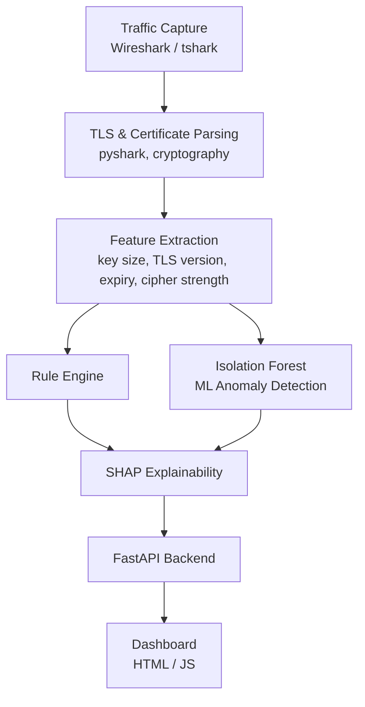

# SecureMailScope
### AI-Assisted Cryptographic Security Posture Assessment for Secure Email Communications

Built for Smart India Hackathon 2026 — Problem Statement (NTRO): *AI-Assisted Cryptographic Security Posture Assessment for Secure Email Communications*

## Problem

TLS/SMTP/IMAP/POP3 deployments frequently suffer from cryptographic misconfigurations — expired certificates, weak keys, deprecated TLS versions — that expose email infrastructure to downgrade attacks and interception. Existing tools focus on packet decoding, not automated risk assessment. There is also very little labeled attack data for TLS misconfigurations, making purely rule-based detection incomplete.

## Solution

SecureMailScope passively analyzes email traffic (live connections or PCAP captures) and combines:

- **Rule-based checks** against known-bad patterns (expired certs, weak keys, deprecated TLS)
- **Unsupervised ML anomaly detection** (Isolation Forest) trained on cryptographic feature vectors, catching misconfigurations that don't match any hardcoded rule
- **SHAP explainability** so every AI verdict comes with a human-readable justification, not a black-box label
- **A live dashboard** presenting risk scores, findings, and feature-level explanations

## Architecture



## Tech Stack

- **Traffic analysis**: Wireshark, tshark, pyshark
- **Certificate/TLS parsing**: Python `ssl`, `cryptography`
- **ML**: scikit-learn (Isolation Forest), SHAP
- **Backend**: FastAPI
- **Frontend**: HTML/CSS/JavaScript (fetches live data from the API)
- **Test infrastructure**: Docker (docker-mailserver, Postfix + Dovecot) — one healthy server, one deliberately misconfigured server for validation

## Key Result

The Isolation Forest model, trained entirely on synthetic data, correctly classified two **real, independently captured** mail servers it had never seen:

| Server | Risk Score | ML Verdict | Top SHAP Factor |
|---|---|---|---|
| Healthy (TLS 1.3, valid cert) | 25/100 | NORMAL | days_remaining |
| Vulnerable (expired cert) | 75/100 | ANOMALOUS | is_expired (-3.58) |

## Running the Project

```bash
# 1. Start the backend
python -m uvicorn main:app --reload

# 2. Open dashboard.html in a browser
```

## Project Structure

- `send_test_mail.py` — sends a STARTTLS test email to generate sample traffic
- `parse_pcap.py` — extracts TLS handshake details from a captured PCAP
- `check_cert.py` / `check_cert_vuln.py` — live certificate inspection
- `risk_engine.py` — rule-based cryptographic risk scoring
- `feature_extraction.py` — converts a live TLS session into an ML feature vector
- `generate_training_data.py` — synthetic dataset generation
- `train_model.py` — trains the Isolation Forest model
- `explain_prediction.py` — SHAP explainability
- `main.py` — FastAPI backend tying the full pipeline together
- `dashboard.html` — live web dashboard

## Team

**Team Hackjackers**

## Future Work

- Extend feature extraction to full PCAP-based passive analysis (currently ML/feature extraction runs live; full passive TLS 1.3 cert inspection requires SSLKEYLOGFILE-based decryption, documented as a known constraint)
- PDF/JSON exportable forensic reports
- Interactive topology graph of monitored infrastructure
- Compliance mapping (NIST SP 800-52, RFC 8314, CIS benchmarks)